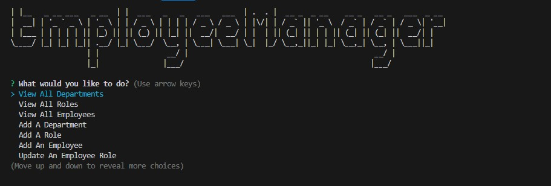
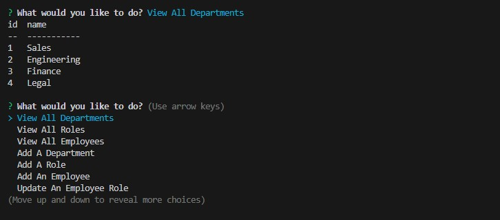

# Employee-Tracker
## Description
A command-line content management systems (CMS) application to manage a company's employee database, using Node.js, Inquirer, and MySQL.
## Table of Contents
- [Installation](#installation)
- [Usage](#usage)
- [License](#license)
- [Badges](#badges)
- [Tests](#tests)
- [Questions](#questions)

## Installation
To use this project, you will need to first install dependencies. You can do this by using the following command in the terminal:   `$ npm i` 

## Usage
You can view a video demonstration of how to use this application [here.](https://drive.google.com/file/d/1kmdRNRlmN29gLsAASYQzHss8JOrw86Ci/view)  
To run the program, use the following command in the terminal:  `$ node index.js`  OR   `$ npm start`  
You will be prompted with several options view employee data, add data, or update data.     

    
    
    
    
    

## Credits
Worked with tutor Chris Baird to debug functions

## License
MIT License

## Badges

## Tests
N/A 

## Questions
GitHub Profile: [https://github.com/Daniel-Covington/Employee_Tracker](https://github.com/Daniel-Covington/Employee_Tracker) 
For further questions, you can reach me at danielmcovington@gmail.com

